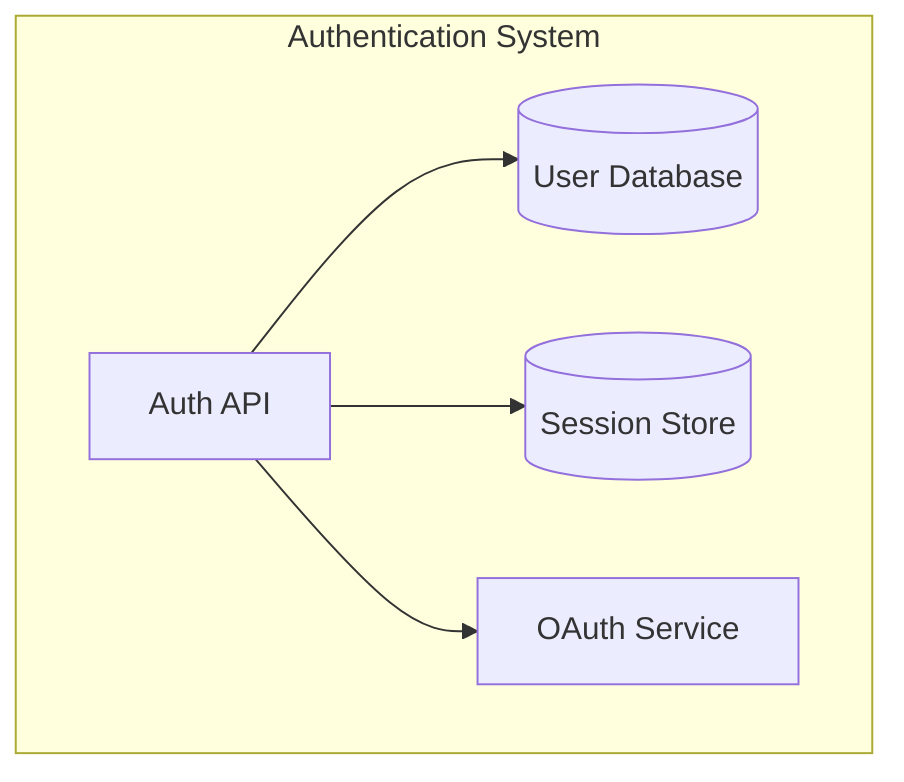
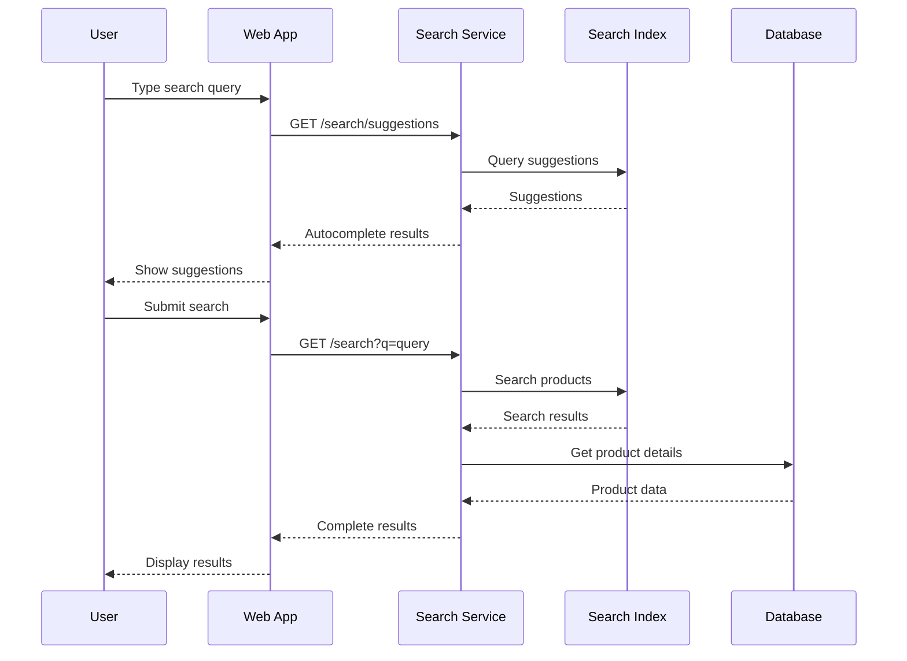
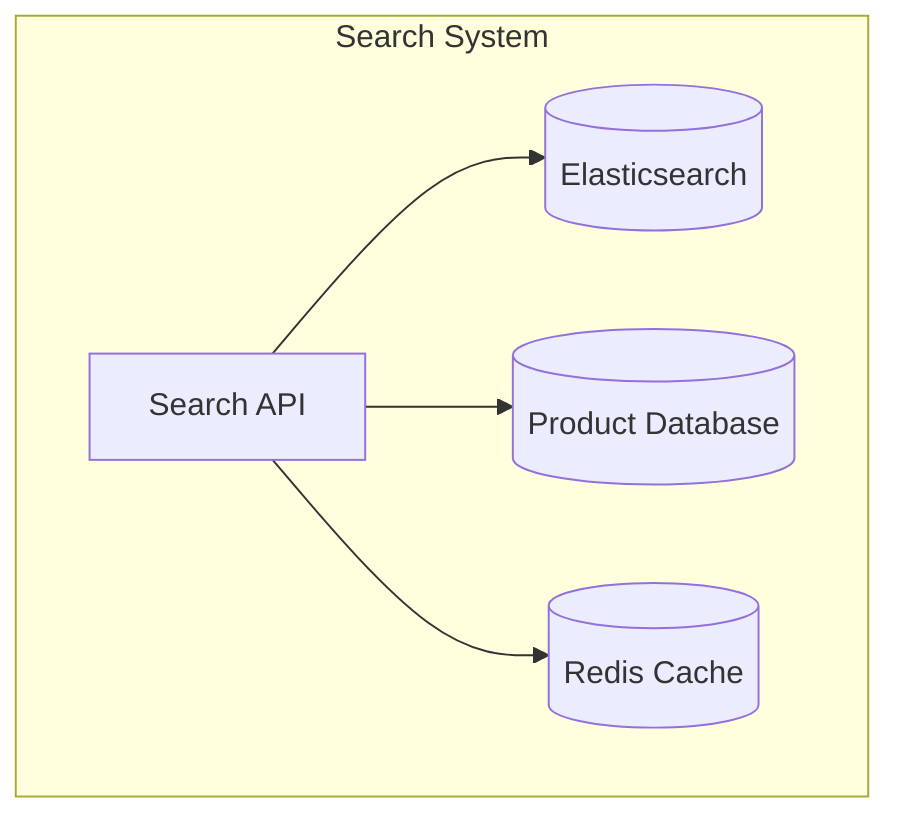
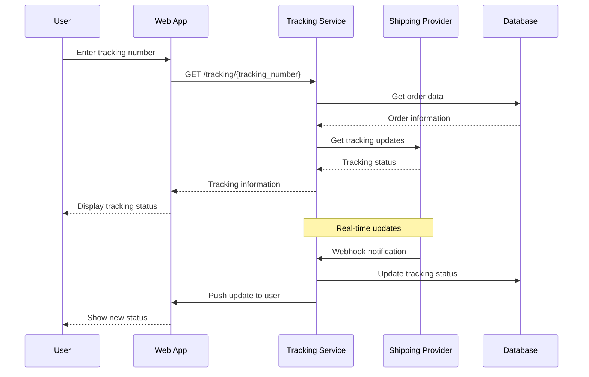
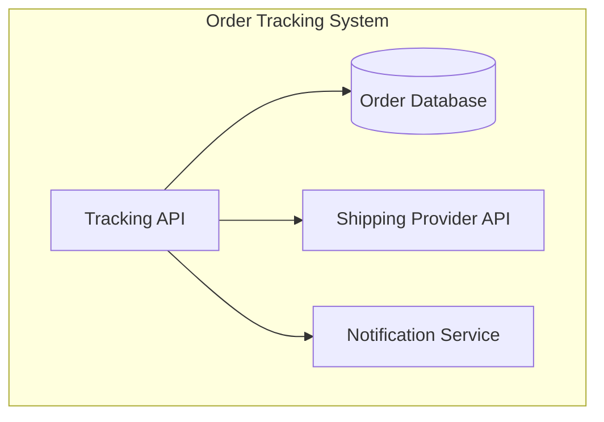

# Design-First Approach - Examples

## Example 1: User Authentication Feature

### 1. Feature Description

#### 1.1 Why?
**Business Justification:**
- Current login system has 40% abandonment rate
- Users forget passwords frequently, leading to support tickets
- No social login options, losing potential users
- Security vulnerabilities in current authentication system

#### 1.2 Goal
**Success Metrics:**
- Reduce login abandonment rate to 15%
- Increase user registration by 30%
- Reduce password reset requests by 50%
- Achieve 99.9% authentication success rate

#### 1.3 Challenges / Risks
**Technical Risks:**
- OAuth integration complexity
- Session management security
- Multi-factor authentication implementation
- Password encryption and storage

**Business Risks:**
- User adoption of new login methods
- Compliance with GDPR and data protection laws
- Potential security breaches
- User experience disruption during transition

### 2. Non-functional Requirements

#### 2.1 Performance
- Login response time < 500ms
- Support 10,000 concurrent users
- 99.9% uptime for authentication service
- Session timeout: 24 hours for active users

#### 2.2 Security
- Password hashing with bcrypt (12 rounds)
- JWT tokens with 1-hour expiration
- Rate limiting: 5 failed attempts per 15 minutes
- HTTPS enforcement for all authentication endpoints

### 3. Sequence Diagram


### 4. Actions
1. **Login with Email/Password**
2. **Social Login (Google/Facebook)**
3. **Password Reset**
4. **Account Registration**
5. **Logout**

### 5. C4 Diagrams


### 6. Database Structure
```sql
CREATE TABLE users (
    id UUID PRIMARY KEY,
    email VARCHAR(255) UNIQUE NOT NULL,
    password_hash VARCHAR(255),
    first_name VARCHAR(100),
    last_name VARCHAR(100),
    email_verified BOOLEAN DEFAULT FALSE,
    created_at TIMESTAMP DEFAULT CURRENT_TIMESTAMP,
    updated_at TIMESTAMP DEFAULT CURRENT_TIMESTAMP
);

CREATE TABLE oauth_accounts (
    id UUID PRIMARY KEY,
    user_id UUID REFERENCES users(id),
    provider VARCHAR(50) NOT NULL,
    provider_id VARCHAR(255) NOT NULL,
    created_at TIMESTAMP DEFAULT CURRENT_TIMESTAMP
);
```

### 7. API Documentation
```yaml
paths:
  /auth/login:
    post:
      summary: User login
      requestBody:
        content:
          application/json:
            schema:
              type: object
              properties:
                email:
                  type: string
                  format: email
                password:
                  type: string
      responses:
        '200':
          description: Login successful
          content:
            application/json:
              schema:
                type: object
                properties:
                  token:
                    type: string
                  user:
                    $ref: '#/components/schemas/User'
```

### 8. Test Coverage Requirements
- Unit tests: 85% coverage
- Integration tests: All auth endpoints
- E2E tests: Complete login/logout flow
- Security tests: Password validation, rate limiting
- Performance tests: Load testing with 10,000 users

---

## Example 2: Product Search Feature

### 1. Feature Description

#### 1.1 Why?
**Business Justification:**
- Current search has 60% "no results" rate
- Users can't find products easily
- Competitors have better search functionality
- Poor search experience leads to cart abandonment

#### 1.2 Goal
**Success Metrics:**
- Reduce "no results" rate to 20%
- Increase search-to-purchase conversion by 25%
- Improve search relevance score to 85%
- Reduce average search time to 3 seconds

#### 1.3 Challenges / Risks
**Technical Risks:**
- Search index performance
- Real-time inventory updates
- Multi-language search support
- Search result ranking algorithm

**Business Risks:**
- Search algorithm bias
- Performance impact on database
- User adoption of new search features
- SEO impact of search changes

### 2. Non-functional Requirements

#### 2.1 Performance
- Search response time < 200ms
- Support 5,000 concurrent searches
- Search index update latency < 30 seconds
- Autocomplete response time < 100ms

#### 2.2 Usability
- Support for typos and synonyms
- Search suggestions and autocomplete
- Filter and sort options
- Mobile-optimized search interface

### 3. Sequence Diagram


### 4. Actions
1. **Search Input with Autocomplete**
2. **Execute Search Query**
3. **Filter Search Results**
4. **Sort Search Results**
5. **View Product Details**

### 5. C4 Diagrams


### 6. Database Structure
```sql
-- Search index structure (Elasticsearch)
{
  "mappings": {
    "properties": {
      "id": {"type": "keyword"},
      "name": {"type": "text", "analyzer": "standard"},
      "description": {"type": "text", "analyzer": "standard"},
      "category": {"type": "keyword"},
      "price": {"type": "float"},
      "in_stock": {"type": "boolean"},
      "tags": {"type": "keyword"},
      "created_at": {"type": "date"}
    }
  }
}
```

### 7. API Documentation
```yaml
paths:
  /search:
    get:
      summary: Search products
      parameters:
        - name: q
          in: query
          required: true
          schema:
            type: string
        - name: category
          in: query
          schema:
            type: string
        - name: min_price
          in: query
          schema:
            type: number
        - name: max_price
          in: query
          schema:
            type: number
        - name: sort
          in: query
          schema:
            type: string
            enum: [relevance, price_asc, price_desc, newest]
      responses:
        '200':
          description: Search results
          content:
            application/json:
              schema:
                type: object
                properties:
                  results:
                    type: array
                    items:
                      $ref: '#/components/schemas/Product'
                  total:
                    type: integer
                  facets:
                    type: object
```

### 8. Test Coverage Requirements
- Unit tests: 80% coverage
- Integration tests: Search API endpoints
- E2E tests: Complete search flow
- Performance tests: Search under load
- Accuracy tests: Search relevance validation

---

## Example 3: Order Tracking Feature

### 1. Feature Description

#### 1.1 Why?
**Business Justification:**
- 35% of customers contact support for order updates
- No real-time tracking information available
- Customers want visibility into order status
- Reduce support ticket volume

#### 1.2 Goal
**Success Metrics:**
- Reduce order status inquiries by 60%
- Increase customer satisfaction score to 4.5/5
- Provide real-time tracking updates
- Reduce support ticket volume by 40%

#### 1.3 Challenges / Risks
**Technical Risks:**
- Integration with shipping providers
- Real-time data synchronization
- Mobile app push notifications
- Data accuracy and reliability

**Business Risks:**
- Shipping provider API changes
- Customer expectations management
- Privacy concerns with tracking data
- International shipping complexities

### 2. Non-functional Requirements

#### 2.1 Performance
- Tracking page load time < 2 seconds
- Real-time updates every 30 seconds
- Support 1,000 concurrent tracking sessions
- 99.5% tracking data accuracy

#### 2.2 Reliability
- Fallback to manual updates if API fails
- Historical tracking data retention (1 year)
- Error handling for missing tracking info
- Backup tracking data sources

### 3. Sequence Diagram


### 4. Actions
1. **Enter Tracking Number**
2. **View Order Status**
3. **Receive Status Updates**
4. **View Delivery Timeline**
5. **Contact Support if Issues**

### 5. C4 Diagrams


### 6. Database Structure
```sql
CREATE TABLE order_tracking (
    id UUID PRIMARY KEY,
    order_id UUID REFERENCES orders(id),
    tracking_number VARCHAR(100) NOT NULL,
    carrier VARCHAR(50) NOT NULL,
    status VARCHAR(50) NOT NULL,
    location VARCHAR(255),
    timestamp TIMESTAMP NOT NULL,
    description TEXT,
    created_at TIMESTAMP DEFAULT CURRENT_TIMESTAMP
);

CREATE TABLE tracking_webhooks (
    id UUID PRIMARY KEY,
    tracking_number VARCHAR(100) NOT NULL,
    carrier VARCHAR(50) NOT NULL,
    payload JSONB NOT NULL,
    processed BOOLEAN DEFAULT FALSE,
    created_at TIMESTAMP DEFAULT CURRENT_TIMESTAMP
);
```

### 7. API Documentation
```yaml
paths:
  /tracking/{tracking_number}:
    get:
      summary: Get order tracking information
      parameters:
        - name: tracking_number
          in: path
          required: true
          schema:
            type: string
      responses:
        '200':
          description: Tracking information
          content:
            application/json:
              schema:
                type: object
                properties:
                  tracking_number:
                    type: string
                  status:
                    type: string
                  carrier:
                    type: string
                  events:
                    type: array
                    items:
                      type: object
                      properties:
                        status:
                          type: string
                        location:
                          type: string
                        timestamp:
                          type: string
                          format: date-time
                        description:
                          type: string
                  estimated_delivery:
                    type: string
                    format: date
```

### 8. Test Coverage Requirements
- Unit tests: 85% coverage
- Integration tests: Tracking API and webhooks
- E2E tests: Complete tracking flow
- Performance tests: Real-time update handling
- Reliability tests: API failure scenarios

These examples demonstrate how to apply the feature design template to different types of features, showing the level of detail and structure expected for each section.
