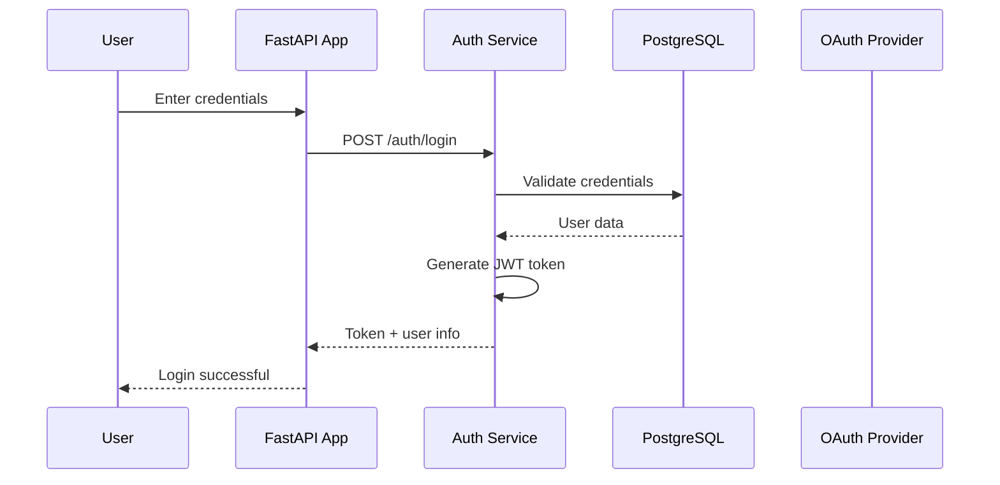
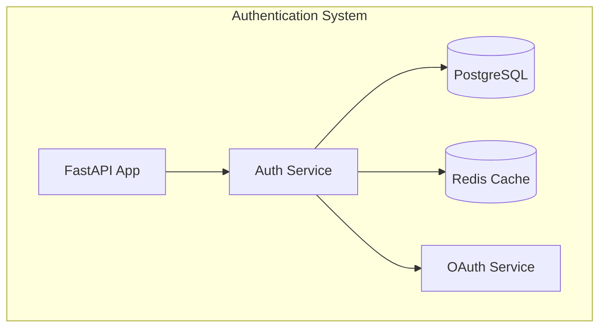
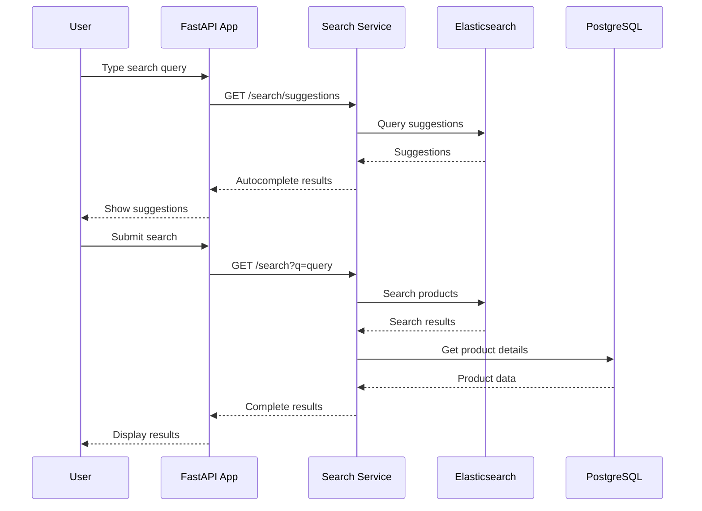
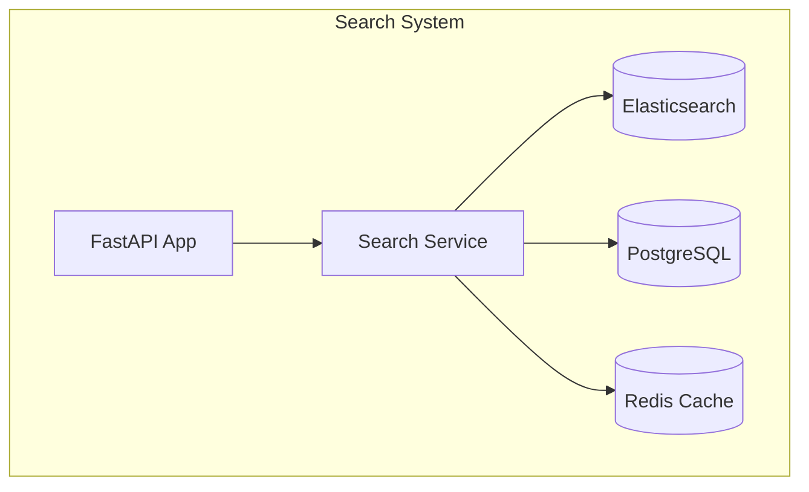
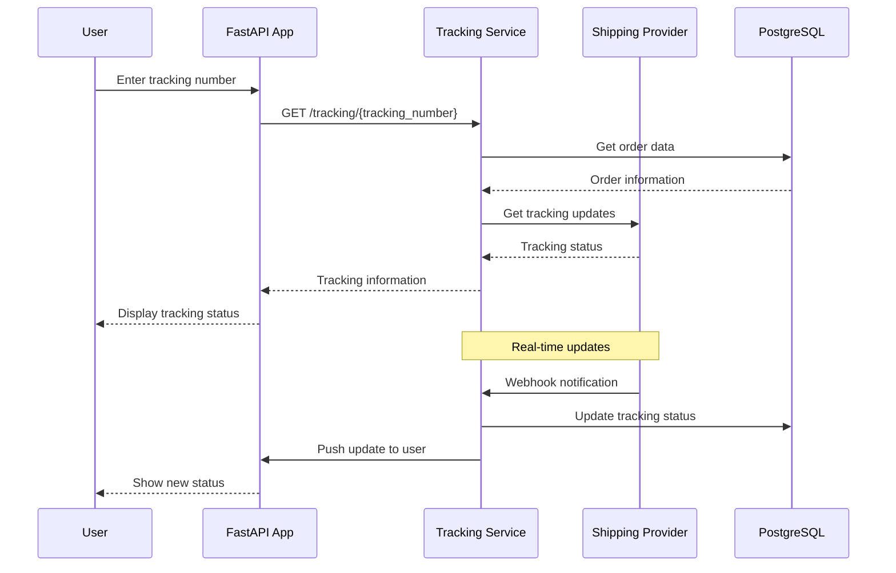
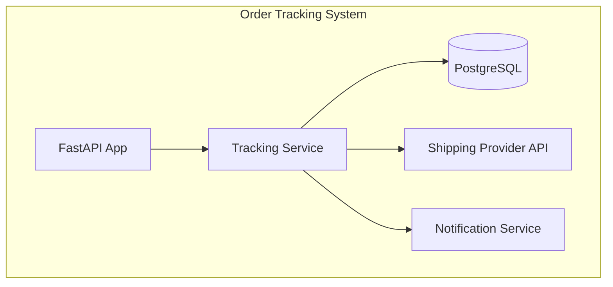

# Design-First Approach - Python Examples

## Example 1: User Authentication Feature

### 1. Feature Description

#### 1.1 Why?
**Business Justification:**
- Current login system has 40% abandonment rate
- Users forget passwords frequently, leading to support tickets
- No social login options, losing potential users
- Security vulnerabilities in current authentication system

#### 1.2 Goal
**Success Metrics:**
- Reduce login abandonment rate to 15%
- Increase user registration by 30%
- Reduce password reset requests by 50%
- Achieve 99.9% authentication success rate

#### 1.3 Challenges / Risks
**Technical Risks:**
- OAuth integration complexity
- Session management security
- Multi-factor authentication implementation
- Password encryption and storage

**Business Risks:**
- User adoption of new login methods
- Compliance with GDPR and data protection laws
- Potential security breaches
- User experience disruption during transition

### 2. Non-functional Requirements

#### 2.1 Performance
- Login response time < 500ms
- Support 10,000 concurrent users
- 99.9% uptime for authentication service
- Session timeout: 24 hours for active users

#### 2.2 Security
- Password hashing with bcrypt (12 rounds)
- JWT tokens with 1-hour expiration
- Rate limiting: 5 failed attempts per 15 minutes
- HTTPS enforcement for all authentication endpoints

### 3. Sequence Diagram


### 4. Actions
1. **Login with Email/Password**
2. **Social Login (Google/Facebook)**
3. **Password Reset**
4. **Account Registration**
5. **Logout**

### 5. C4 Diagrams


### 6. Database Structure
```python
# SQLAlchemy Models
from sqlalchemy import Column, String, Boolean, DateTime, ForeignKey
from sqlalchemy.dialects.postgresql import UUID
from sqlalchemy.ext.declarative import declarative_base
from sqlalchemy.orm import relationship
import uuid
from datetime import datetime

Base = declarative_base()

class User(Base):
    __tablename__ = "users"
    
    id = Column(UUID(as_uuid=True), primary_key=True, default=uuid.uuid4)
    email = Column(String(255), unique=True, nullable=False)
    password_hash = Column(String(255))
    first_name = Column(String(100))
    last_name = Column(String(100))
    email_verified = Column(Boolean, default=False)
    created_at = Column(DateTime, default=datetime.utcnow)
    updated_at = Column(DateTime, default=datetime.utcnow, onupdate=datetime.utcnow)
    
    oauth_accounts = relationship("OAuthAccount", back_populates="user")

class OAuthAccount(Base):
    __tablename__ = "oauth_accounts"
    
    id = Column(UUID(as_uuid=True), primary_key=True, default=uuid.uuid4)
    user_id = Column(UUID(as_uuid=True), ForeignKey("users.id"))
    provider = Column(String(50), nullable=False)
    provider_id = Column(String(255), nullable=False)
    created_at = Column(DateTime, default=datetime.utcnow)
    
    user = relationship("User", back_populates="oauth_accounts")
```

### 7. API Documentation
```python
# FastAPI Implementation
from fastapi import FastAPI, Depends, HTTPException, status
from fastapi.security import HTTPBearer, HTTPAuthorizationCredentials
from pydantic import BaseModel, EmailStr
from passlib.context import CryptContext
from jose import JWTError, jwt
from datetime import datetime, timedelta
import os

app = FastAPI(title="Authentication API", version="1.0.0")

# Pydantic Models
class UserLogin(BaseModel):
    email: EmailStr
    password: str

class UserResponse(BaseModel):
    id: str
    email: str
    first_name: str
    last_name: str
    email_verified: bool

class LoginResponse(BaseModel):
    access_token: str
    token_type: str
    user: UserResponse

# Security
pwd_context = CryptContext(schemes=["bcrypt"], deprecated="auto")
security = HTTPBearer()

@app.post("/auth/login", response_model=LoginResponse)
async def login(user_credentials: UserLogin):
    """
    User login endpoint
    
    - **email**: User's email address
    - **password**: User's password
    
    Returns JWT token and user information
    """
    # Validate credentials
    user = await authenticate_user(user_credentials.email, user_credentials.password)
    if not user:
        raise HTTPException(
            status_code=status.HTTP_401_UNAUTHORIZED,
            detail="Incorrect email or password"
        )
    
    # Generate JWT token
    access_token = create_access_token(data={"sub": str(user.id)})
    
    return LoginResponse(
        access_token=access_token,
        token_type="bearer",
        user=UserResponse(
            id=str(user.id),
            email=user.email,
            first_name=user.first_name,
            last_name=user.last_name,
            email_verified=user.email_verified
        )
    )

@app.get("/auth/me", response_model=UserResponse)
async def get_current_user(credentials: HTTPAuthorizationCredentials = Depends(security)):
    """
    Get current user information
    
    Requires valid JWT token in Authorization header
    """
    token = credentials.credentials
    user = await get_current_user_from_token(token)
    return UserResponse(
        id=str(user.id),
        email=user.email,
        first_name=user.first_name,
        last_name=user.last_name,
        email_verified=user.email_verified
    )
```

### 8. Test Coverage Requirements
```python
# pytest tests
import pytest
from fastapi.testclient import TestClient
from unittest.mock import patch, MagicMock

class TestAuthAPI:
    def setup_method(self):
        self.client = TestClient(app)
    
    def test_login_success(self):
        """Test successful login"""
        login_data = {
            "email": "test@example.com",
            "password": "password123"
        }
        
        with patch('app.authenticate_user') as mock_auth:
            mock_user = MagicMock()
            mock_user.id = "user-123"
            mock_user.email = "test@example.com"
            mock_user.first_name = "John"
            mock_user.last_name = "Doe"
            mock_user.email_verified = True
            mock_auth.return_value = mock_user
            
            response = self.client.post("/auth/login", json=login_data)
            
            assert response.status_code == 200
            data = response.json()
            assert "access_token" in data
            assert data["user"]["email"] == "test@example.com"
    
    def test_login_invalid_credentials(self):
        """Test login with invalid credentials"""
        login_data = {
            "email": "test@example.com",
            "password": "wrongpassword"
        }
        
        with patch('app.authenticate_user') as mock_auth:
            mock_auth.return_value = None
            
            response = self.client.post("/auth/login", json=login_data)
            
            assert response.status_code == 401
            assert "Incorrect email or password" in response.json()["detail"]
    
    def test_get_current_user(self):
        """Test getting current user with valid token"""
        with patch('app.get_current_user_from_token') as mock_get_user:
            mock_user = MagicMock()
            mock_user.id = "user-123"
            mock_user.email = "test@example.com"
            mock_get_user.return_value = mock_user
            
            response = self.client.get(
                "/auth/me",
                headers={"Authorization": "Bearer valid-token"}
            )
            
            assert response.status_code == 200
            data = response.json()
            assert data["email"] == "test@example.com"

# Test coverage requirements:
# - Unit tests: 85% coverage
# - Integration tests: All auth endpoints
# - E2E tests: Complete login/logout flow
# - Security tests: Password validation, rate limiting
# - Performance tests: Load testing with 10,000 users
```

---

## Example 2: Product Search Feature

### 1. Feature Description

#### 1.1 Why?
**Business Justification:**
- Current search has 60% "no results" rate
- Users can't find products easily
- Competitors have better search functionality
- Poor search experience leads to cart abandonment

#### 1.2 Goal
**Success Metrics:**
- Reduce "no results" rate to 20%
- Increase search-to-purchase conversion by 25%
- Improve search relevance score to 85%
- Reduce average search time to 3 seconds

#### 1.3 Challenges / Risks
**Technical Risks:**
- Search index performance
- Real-time inventory updates
- Multi-language search support
- Search result ranking algorithm

**Business Risks:**
- Search algorithm bias
- Performance impact on database
- User adoption of new search features
- SEO impact of search changes

### 2. Non-functional Requirements

#### 2.1 Performance
- Search response time < 200ms
- Support 5,000 concurrent searches
- Search index update latency < 30 seconds
- Autocomplete response time < 100ms

#### 2.2 Usability
- Support for typos and synonyms
- Search suggestions and autocomplete
- Filter and sort options
- Mobile-optimized search interface

### 3. Sequence Diagram


### 4. Actions
1. **Search Input with Autocomplete**
2. **Execute Search Query**
3. **Filter Search Results**
4. **Sort Search Results**
5. **View Product Details**

### 5. C4 Diagrams


### 6. Database Structure
```python
# SQLAlchemy Models
from sqlalchemy import Column, String, Float, Boolean, DateTime, Text, JSON
from sqlalchemy.dialects.postgresql import UUID, JSONB
from sqlalchemy.ext.declarative import declarative_base
import uuid
from datetime import datetime

Base = declarative_base()

class Product(Base):
    __tablename__ = "products"
    
    id = Column(UUID(as_uuid=True), primary_key=True, default=uuid.uuid4)
    name = Column(String(255), nullable=False)
    description = Column(Text)
    price = Column(Float, nullable=False)
    category_id = Column(UUID(as_uuid=True), ForeignKey("categories.id"))
    in_stock = Column(Boolean, default=True)
    tags = Column(JSONB)  # For search indexing
    created_at = Column(DateTime, default=datetime.utcnow)
    updated_at = Column(DateTime, default=datetime.utcnow, onupdate=datetime.utcnow)

class Category(Base):
    __tablename__ = "categories"
    
    id = Column(UUID(as_uuid=True), primary_key=True, default=uuid.uuid4)
    name = Column(String(255), nullable=False)
    slug = Column(String(255), unique=True, nullable=False)
    description = Column(Text)
    parent_id = Column(UUID(as_uuid=True), ForeignKey("categories.id"))

# Elasticsearch mapping
ELASTICSEARCH_MAPPING = {
    "mappings": {
        "properties": {
            "id": {"type": "keyword"},
            "name": {"type": "text", "analyzer": "standard"},
            "description": {"type": "text", "analyzer": "standard"},
            "category": {"type": "keyword"},
            "price": {"type": "float"},
            "in_stock": {"type": "boolean"},
            "tags": {"type": "keyword"},
            "created_at": {"type": "date"}
        }
    }
}
```

### 7. API Documentation
```python
# FastAPI Implementation
from fastapi import FastAPI, Query, HTTPException
from pydantic import BaseModel
from typing import List, Optional
from elasticsearch import Elasticsearch
import asyncio

app = FastAPI(title="Product Search API", version="1.0.0")

# Pydantic Models
class ProductResponse(BaseModel):
    id: str
    name: str
    description: str
    price: float
    category: str
    in_stock: bool
    tags: List[str]

class SearchResponse(BaseModel):
    results: List[ProductResponse]
    total: int
    facets: dict
    query_time: float

class SearchFilters(BaseModel):
    category: Optional[str] = None
    min_price: Optional[float] = None
    max_price: Optional[float] = None
    in_stock: Optional[bool] = None

# Elasticsearch client
es = Elasticsearch([{"host": "localhost", "port": 9200}])

@app.get("/search", response_model=SearchResponse)
async def search_products(
    q: str = Query(..., description="Search query"),
    category: Optional[str] = Query(None, description="Filter by category"),
    min_price: Optional[float] = Query(None, description="Minimum price"),
    max_price: Optional[float] = Query(None, description="Maximum price"),
    sort: str = Query("relevance", description="Sort order"),
    page: int = Query(1, ge=1, description="Page number"),
    limit: int = Query(20, ge=1, le=100, description="Items per page")
):
    """
    Search products with filters and sorting
    
    - **q**: Search query string
    - **category**: Filter by category slug
    - **min_price**: Minimum price filter
    - **max_price**: Maximum price filter
    - **sort**: Sort order (relevance, price_asc, price_desc, newest)
    - **page**: Page number (starts from 1)
    - **limit**: Number of items per page (max 100)
    
    Returns paginated search results with facets
    """
    # Build Elasticsearch query
    query_body = {
        "query": {
            "bool": {
                "must": [
                    {
                        "multi_match": {
                            "query": q,
                            "fields": ["name^2", "description", "tags"],
                            "fuzziness": "AUTO"
                        }
                    }
                ],
                "filter": []
            }
        },
        "sort": _build_sort_clause(sort),
        "from": (page - 1) * limit,
        "size": limit,
        "aggs": {
            "categories": {"terms": {"field": "category"}},
            "price_ranges": {
                "histogram": {
                    "field": "price",
                    "interval": 50
                }
            }
        }
    }
    
    # Add filters
    if category:
        query_body["query"]["bool"]["filter"].append({"term": {"category": category}})
    
    if min_price is not None or max_price is not None:
        price_filter = {"range": {"price": {}}}
        if min_price is not None:
            price_filter["range"]["price"]["gte"] = min_price
        if max_price is not None:
            price_filter["range"]["price"]["lte"] = max_price
        query_body["query"]["bool"]["filter"].append(price_filter)
    
    # Execute search
    start_time = asyncio.get_event_loop().time()
    response = es.search(index="products", body=query_body)
    query_time = asyncio.get_event_loop().time() - start_time
    
    # Process results
    results = []
    for hit in response["hits"]["hits"]:
        source = hit["_source"]
        results.append(ProductResponse(
            id=source["id"],
            name=source["name"],
            description=source["description"],
            price=source["price"],
            category=source["category"],
            in_stock=source["in_stock"],
            tags=source.get("tags", [])
        ))
    
    return SearchResponse(
        results=results,
        total=response["hits"]["total"]["value"],
        facets={
            "categories": response["aggregations"]["categories"]["buckets"],
            "price_ranges": response["aggregations"]["price_ranges"]["buckets"]
        },
        query_time=query_time
    )

@app.get("/search/suggestions")
async def get_search_suggestions(
    q: str = Query(..., min_length=2, description="Search query for suggestions")
):
    """
    Get search suggestions for autocomplete
    
    - **q**: Search query (minimum 2 characters)
    
    Returns list of search suggestions
    """
    suggestion_body = {
        "suggest": {
            "product_suggest": {
                "prefix": q,
                "completion": {
                    "field": "suggest",
                    "size": 10
                }
            }
        }
    }
    
    response = es.search(index="products", body=suggestion_body)
    suggestions = []
    
    for option in response["suggest"]["product_suggest"][0]["options"]:
        suggestions.append({
            "text": option["text"],
            "score": option["_score"]
        })
    
    return {"suggestions": suggestions}

def _build_sort_clause(sort: str) -> List[dict]:
    """Build Elasticsearch sort clause based on sort parameter"""
    sort_mapping = {
        "relevance": [{"_score": {"order": "desc"}}],
        "price_asc": [{"price": {"order": "asc"}}],
        "price_desc": [{"price": {"order": "desc"}}],
        "newest": [{"created_at": {"order": "desc"}}]
    }
    return sort_mapping.get(sort, sort_mapping["relevance"])
```

### 8. Test Coverage Requirements
```python
# pytest tests
import pytest
from fastapi.testclient import TestClient
from unittest.mock import patch, MagicMock

class TestSearchAPI:
    def setup_method(self):
        self.client = TestClient(app)
    
    def test_search_products_success(self):
        """Test successful product search"""
        with patch('app.es.search') as mock_search:
            mock_search.return_value = {
                "hits": {
                    "total": {"value": 2},
                    "hits": [
                        {
                            "_source": {
                                "id": "prod-1",
                                "name": "Test Product 1",
                                "description": "Test description",
                                "price": 29.99,
                                "category": "electronics",
                                "in_stock": True,
                                "tags": ["test", "product"]
                            }
                        }
                    ]
                },
                "aggregations": {
                    "categories": {"buckets": []},
                    "price_ranges": {"buckets": []}
                }
            }
            
            response = self.client.get("/search?q=test")
            
            assert response.status_code == 200
            data = response.json()
            assert len(data["results"]) == 1
            assert data["total"] == 2
            assert data["results"][0]["name"] == "Test Product 1"
    
    def test_search_with_filters(self):
        """Test search with price and category filters"""
        with patch('app.es.search') as mock_search:
            mock_search.return_value = {
                "hits": {"total": {"value": 0}, "hits": []},
                "aggregations": {"categories": {"buckets": []}, "price_ranges": {"buckets": []}}
            }
            
            response = self.client.get(
                "/search?q=test&category=electronics&min_price=10&max_price=50"
            )
            
            assert response.status_code == 200
            # Verify that filters were applied to the query
            mock_search.assert_called_once()
            call_args = mock_search.call_args[1]["body"]
            assert "bool" in call_args["query"]
            assert "filter" in call_args["query"]["bool"]
    
    def test_search_suggestions(self):
        """Test search suggestions endpoint"""
        with patch('app.es.search') as mock_search:
            mock_search.return_value = {
                "suggest": {
                    "product_suggest": [{
                        "options": [
                            {"text": "test product", "_score": 1.0},
                            {"text": "test item", "_score": 0.8}
                        ]
                    }]
                }
            }
            
            response = self.client.get("/search/suggestions?q=test")
            
            assert response.status_code == 200
            data = response.json()
            assert len(data["suggestions"]) == 2
            assert data["suggestions"][0]["text"] == "test product"

# Test coverage requirements:
# - Unit tests: 80% coverage
# - Integration tests: Search API endpoints
# - E2E tests: Complete search flow
# - Performance tests: Search under load
# - Accuracy tests: Search relevance validation
```

---

## Example 3: Order Tracking Feature

### 1. Feature Description

#### 1.1 Why?
**Business Justification:**
- 35% of customers contact support for order updates
- No real-time tracking information available
- Customers want visibility into order status
- Reduce support ticket volume

#### 1.2 Goal
**Success Metrics:**
- Reduce order status inquiries by 60%
- Increase customer satisfaction score to 4.5/5
- Provide real-time tracking updates
- Reduce support ticket volume by 40%

#### 1.3 Challenges / Risks
**Technical Risks:**
- Integration with shipping providers
- Real-time data synchronization
- Mobile app push notifications
- Data accuracy and reliability

**Business Risks:**
- Shipping provider API changes
- Customer expectations management
- Privacy concerns with tracking data
- International shipping complexities

### 2. Non-functional Requirements

#### 2.1 Performance
- Tracking page load time < 2 seconds
- Real-time updates every 30 seconds
- Support 1,000 concurrent tracking sessions
- 99.5% tracking data accuracy

#### 2.2 Reliability
- Fallback to manual updates if API fails
- Historical tracking data retention (1 year)
- Error handling for missing tracking info
- Backup tracking data sources

### 3. Sequence Diagram


### 4. Actions
1. **Enter Tracking Number**
2. **View Order Status**
3. **Receive Status Updates**
4. **View Delivery Timeline**
5. **Contact Support if Issues**

### 5. C4 Diagrams


### 6. Database Structure
```python
# SQLAlchemy Models
from sqlalchemy import Column, String, DateTime, Boolean, ForeignKey, Text
from sqlalchemy.dialects.postgresql import UUID, JSONB
from sqlalchemy.ext.declarative import declarative_base
from sqlalchemy.orm import relationship
import uuid
from datetime import datetime

Base = declarative_base()

class Order(Base):
    __tablename__ = "orders"
    
    id = Column(UUID(as_uuid=True), primary_key=True, default=uuid.uuid4)
    order_number = Column(String(50), unique=True, nullable=False)
    user_id = Column(UUID(as_uuid=True), ForeignKey("users.id"))
    status = Column(String(50), default="pending")
    total_amount = Column(Float, nullable=False)
    created_at = Column(DateTime, default=datetime.utcnow)
    updated_at = Column(DateTime, default=datetime.utcnow, onupdate=datetime.utcnow)
    
    tracking = relationship("OrderTracking", back_populates="order")

class OrderTracking(Base):
    __tablename__ = "order_tracking"
    
    id = Column(UUID(as_uuid=True), primary_key=True, default=uuid.uuid4)
    order_id = Column(UUID(as_uuid=True), ForeignKey("orders.id"))
    tracking_number = Column(String(100), nullable=False)
    carrier = Column(String(50), nullable=False)
    status = Column(String(50), nullable=False)
    location = Column(String(255))
    timestamp = Column(DateTime, nullable=False)
    description = Column(Text)
    created_at = Column(DateTime, default=datetime.utcnow)
    
    order = relationship("Order", back_populates="tracking")

class TrackingWebhook(Base):
    __tablename__ = "tracking_webhooks"
    
    id = Column(UUID(as_uuid=True), primary_key=True, default=uuid.uuid4)
    tracking_number = Column(String(100), nullable=False)
    carrier = Column(String(50), nullable=False)
    payload = Column(JSONB, nullable=False)
    processed = Column(Boolean, default=False)
    created_at = Column(DateTime, default=datetime.utcnow)
```

### 7. API Documentation
```python
# FastAPI Implementation
from fastapi import FastAPI, HTTPException, BackgroundTasks
from pydantic import BaseModel
from typing import List, Optional
from datetime import datetime
import httpx
import asyncio

app = FastAPI(title="Order Tracking API", version="1.0.0")

# Pydantic Models
class TrackingEvent(BaseModel):
    status: str
    location: Optional[str] = None
    timestamp: datetime
    description: str

class TrackingResponse(BaseModel):
    tracking_number: str
    status: str
    carrier: str
    events: List[TrackingEvent]
    estimated_delivery: Optional[datetime] = None

class WebhookPayload(BaseModel):
    tracking_number: str
    carrier: str
    status: str
    location: Optional[str] = None
    timestamp: datetime
    description: str

# Shipping provider clients
class ShippingProviderClient:
    def __init__(self, api_key: str):
        self.api_key = api_key
        self.base_url = "https://api.shipping-provider.com"
    
    async def get_tracking_info(self, tracking_number: str) -> dict:
        """Get tracking information from shipping provider"""
        async with httpx.AsyncClient() as client:
            response = await client.get(
                f"{self.base_url}/tracking/{tracking_number}",
                headers={"Authorization": f"Bearer {self.api_key}"}
            )
            response.raise_for_status()
            return response.json()

# Initialize shipping clients
fedex_client = ShippingProviderClient("fedex_api_key")
ups_client = ShippingProviderClient("ups_api_key")
dhl_client = ShippingProviderClient("dhl_api_key")

@app.get("/tracking/{tracking_number}", response_model=TrackingResponse)
async def get_tracking_info(tracking_number: str):
    """
    Get order tracking information
    
    - **tracking_number**: The tracking number to look up
    
    Returns tracking status, events, and estimated delivery
    """
    # Get order from database
    order_tracking = await get_order_tracking_by_number(tracking_number)
    if not order_tracking:
        raise HTTPException(status_code=404, detail="Tracking number not found")
    
    # Get latest tracking info from shipping provider
    try:
        if order_tracking.carrier == "fedex":
            tracking_data = await fedex_client.get_tracking_info(tracking_number)
        elif order_tracking.carrier == "ups":
            tracking_data = await ups_client.get_tracking_info(tracking_number)
        elif order_tracking.carrier == "dhl":
            tracking_data = await dhl_client.get_tracking_info(tracking_number)
        else:
            raise HTTPException(status_code=400, detail="Unsupported carrier")
        
        # Process tracking events
        events = []
        for event_data in tracking_data.get("events", []):
            events.append(TrackingEvent(
                status=event_data["status"],
                location=event_data.get("location"),
                timestamp=datetime.fromisoformat(event_data["timestamp"]),
                description=event_data["description"]
            ))
        
        return TrackingResponse(
            tracking_number=tracking_number,
            status=tracking_data["current_status"],
            carrier=order_tracking.carrier,
            events=events,
            estimated_delivery=datetime.fromisoformat(tracking_data["estimated_delivery"]) if tracking_data.get("estimated_delivery") else None
        )
    
    except httpx.HTTPError:
        # Fallback to cached data if API fails
        cached_events = await get_cached_tracking_events(tracking_number)
        return TrackingResponse(
            tracking_number=tracking_number,
            status=order_tracking.status,
            carrier=order_tracking.carrier,
            events=cached_events,
            estimated_delivery=None
        )

@app.post("/webhooks/tracking")
async def receive_tracking_webhook(
    payload: WebhookPayload,
    background_tasks: BackgroundTasks
):
    """
    Receive tracking updates from shipping providers
    
    This endpoint is called by shipping providers when tracking status changes
    """
    # Store webhook payload
    webhook = TrackingWebhook(
        tracking_number=payload.tracking_number,
        carrier=payload.carrier,
        payload=payload.dict()
    )
    await save_webhook(webhook)
    
    # Process webhook in background
    background_tasks.add_task(process_tracking_webhook, webhook.id)
    
    return {"status": "received"}

async def process_tracking_webhook(webhook_id: str):
    """Process tracking webhook and update order status"""
    webhook = await get_webhook_by_id(webhook_id)
    if not webhook:
        return
    
    # Update order tracking
    await update_order_tracking(
        webhook.tracking_number,
        webhook.payload["status"],
        webhook.payload.get("location"),
        webhook.payload["timestamp"],
        webhook.payload["description"]
    )
    
    # Send notification to user
    await send_tracking_notification(webhook.tracking_number, webhook.payload)
    
    # Mark webhook as processed
    webhook.processed = True
    await save_webhook(webhook)

@app.get("/tracking/{tracking_number}/subscribe")
async def subscribe_to_tracking_updates(tracking_number: str):
    """
    Subscribe to real-time tracking updates
    
    - **tracking_number**: The tracking number to subscribe to
    
    Returns WebSocket connection for real-time updates
    """
    # This would typically return a WebSocket connection
    # For this example, we'll return subscription confirmation
    return {
        "tracking_number": tracking_number,
        "status": "subscribed",
        "message": "You will receive real-time updates for this tracking number"
    }
```

### 8. Test Coverage Requirements
```python
# pytest tests
import pytest
from fastapi.testclient import TestClient
from unittest.mock import patch, AsyncMock, MagicMock
from datetime import datetime

class TestTrackingAPI:
    def setup_method(self):
        self.client = TestClient(app)
    
    def test_get_tracking_info_success(self):
        """Test successful tracking info retrieval"""
        with patch('app.get_order_tracking_by_number') as mock_get_tracking, \
             patch('app.fedex_client.get_tracking_info') as mock_fedex:
            
            # Mock database response
            mock_tracking = MagicMock()
            mock_tracking.carrier = "fedex"
            mock_tracking.status = "in_transit"
            mock_get_tracking.return_value = mock_tracking
            
            # Mock shipping provider response
            mock_fedex.return_value = {
                "current_status": "in_transit",
                "events": [
                    {
                        "status": "picked_up",
                        "location": "New York, NY",
                        "timestamp": "2024-01-01T10:00:00Z",
                        "description": "Package picked up"
                    }
                ],
                "estimated_delivery": "2024-01-03T18:00:00Z"
            }
            
            response = self.client.get("/tracking/1Z999AA1234567890")
            
            assert response.status_code == 200
            data = response.json()
            assert data["tracking_number"] == "1Z999AA1234567890"
            assert data["carrier"] == "fedex"
            assert len(data["events"]) == 1
            assert data["events"][0]["status"] == "picked_up"
    
    def test_get_tracking_info_not_found(self):
        """Test tracking info for non-existent tracking number"""
        with patch('app.get_order_tracking_by_number') as mock_get_tracking:
            mock_get_tracking.return_value = None
            
            response = self.client.get("/tracking/invalid-tracking")
            
            assert response.status_code == 404
            assert "Tracking number not found" in response.json()["detail"]
    
    def test_tracking_webhook_reception(self):
        """Test receiving tracking webhook from shipping provider"""
        webhook_payload = {
            "tracking_number": "1Z999AA1234567890",
            "carrier": "fedex",
            "status": "delivered",
            "location": "New York, NY",
            "timestamp": "2024-01-03T15:30:00Z",
            "description": "Package delivered"
        }
        
        with patch('app.save_webhook') as mock_save_webhook, \
             patch('app.process_tracking_webhook') as mock_process:
            
            response = self.client.post("/webhooks/tracking", json=webhook_payload)
            
            assert response.status_code == 200
            assert response.json()["status"] == "received"
            mock_save_webhook.assert_called_once()
    
    def test_tracking_api_fallback(self):
        """Test fallback to cached data when shipping API fails"""
        with patch('app.get_order_tracking_by_number') as mock_get_tracking, \
             patch('app.fedex_client.get_tracking_info') as mock_fedex, \
             patch('app.get_cached_tracking_events') as mock_cached:
            
            # Mock database response
            mock_tracking = MagicMock()
            mock_tracking.carrier = "fedex"
            mock_tracking.status = "in_transit"
            mock_get_tracking.return_value = mock_tracking
            
            # Mock API failure
            mock_fedex.side_effect = httpx.HTTPError("API Error")
            
            # Mock cached data
            mock_cached.return_value = [
                TrackingEvent(
                    status="picked_up",
                    location="New York, NY",
                    timestamp=datetime.now(),
                    description="Package picked up"
                )
            ]
            
            response = self.client.get("/tracking/1Z999AA1234567890")
            
            assert response.status_code == 200
            data = response.json()
            assert data["status"] == "in_transit"
            assert len(data["events"]) == 1

# Test coverage requirements:
# - Unit tests: 85% coverage
# - Integration tests: Tracking API and webhooks
# - E2E tests: Complete tracking flow
# - Performance tests: Real-time update handling
# - Reliability tests: API failure scenarios
```

These Python examples demonstrate how to apply the feature design template to different types of features, showing the level of detail and structure expected for each section with FastAPI, SQLAlchemy, and pytest.