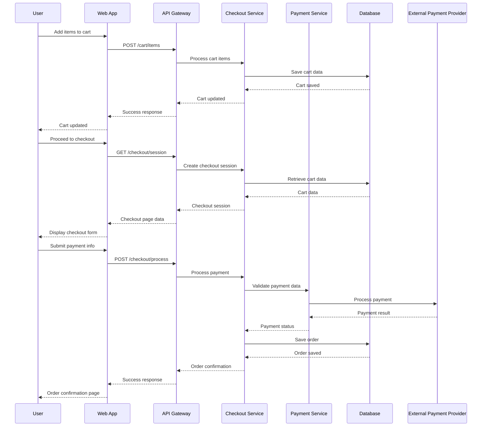
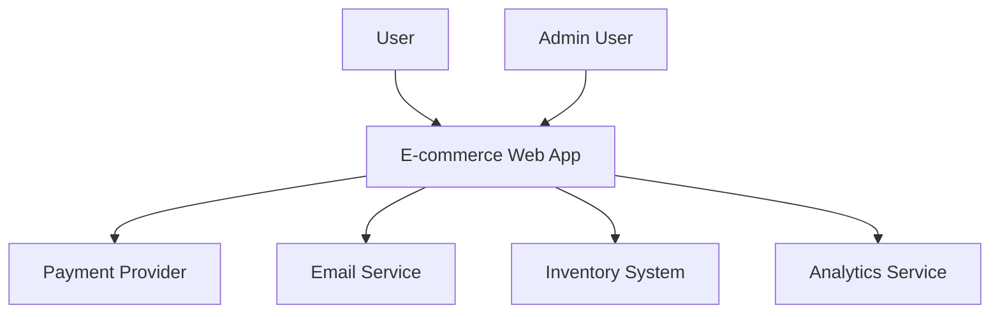
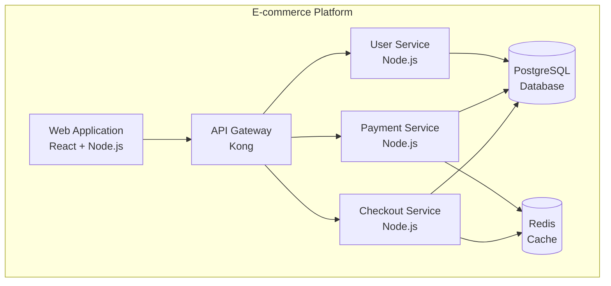
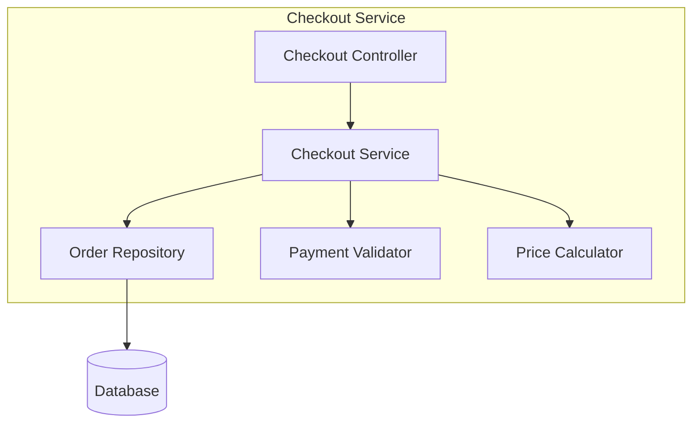

# Design-First Approach - Feature Template

## 1. Feature Description

### 1.1 Why?
**Business Justification:**
- What business problem does this feature solve?
- What user pain point are we addressing?
- What opportunity are we capturing?

**Example:**
- Users are abandoning the checkout process due to complex payment forms
- Competitors offer one-click checkout, we're losing sales
- Mobile users struggle with multi-step checkout on small screens

### 1.2 Goal
**Success Metrics:**
- Primary goal: Increase checkout completion rate by 25%
- Secondary goals: Reduce checkout time by 40%, improve mobile conversion by 15%
- Success criteria: 80% of users complete checkout in under 2 minutes

**User Stories:**
- As a customer, I want to complete my purchase quickly so I don't abandon my cart
- As a mobile user, I want a streamlined checkout so I can buy on my phone easily
- As a returning customer, I want to save my payment info so I can checkout faster

### 1.3 Challenges / Risks
**Technical Risks:**
- Integration complexity with multiple payment providers
- PCI DSS compliance requirements
- Data security and encryption challenges
- Performance impact on checkout flow

**Business Risks:**
- User adoption of new checkout process
- Potential increase in fraud attempts
- Regulatory compliance in different countries
- Impact on existing payment processing

**Mitigation Strategies:**
- Phased rollout with A/B testing
- Comprehensive security audit
- Fallback to existing checkout process
- Extensive user testing and feedback

## 2. Non-functional Requirements

### 2.1 Performance
- **Response Time:** Checkout page load < 2 seconds
- **Throughput:** Support 1000 concurrent checkout sessions
- **Availability:** 99.9% uptime during business hours
- **Scalability:** Handle 10x traffic spikes during sales events

### 2.2 Security
- **Data Protection:** PCI DSS Level 1 compliance
- **Encryption:** AES-256 for data at rest, TLS 1.3 for data in transit
- **Authentication:** Multi-factor authentication for saved payment methods
- **Fraud Prevention:** Real-time fraud detection and prevention

### 2.3 Usability
- **Accessibility:** WCAG 2.1 AA compliance
- **Mobile:** Responsive design for all screen sizes
- **Internationalization:** Support for 5 languages and multiple currencies
- **Error Handling:** Clear, actionable error messages

### 2.4 Reliability
- **Error Rate:** < 0.1% transaction failures
- **Recovery:** Automatic failover to backup payment providers
- **Monitoring:** Real-time transaction monitoring and alerting
- **Backup:** Daily encrypted backups of transaction data

## 3. Sequence Diagram



## 4. Actions

### 4.1 User Actions
1. **Add to Cart**
   - User selects product
   - System validates availability
   - Cart is updated
   - User sees confirmation

2. **View Cart**
   - User clicks cart icon
   - System retrieves cart items
   - Cart summary is displayed
   - User can modify quantities

3. **Proceed to Checkout**
   - User clicks checkout button
   - System validates cart
   - Checkout form is displayed
   - User enters shipping info

4. **Enter Payment Info**
   - User fills payment form
   - System validates input
   - Payment method is saved (optional)
   - User confirms order

5. **Complete Purchase**
   - User clicks place order
   - System processes payment
   - Order confirmation is sent
   - User receives confirmation

### 4.2 System Actions
1. **Cart Management**
   - Validate product availability
   - Calculate pricing and taxes
   - Apply discounts and promotions
   - Persist cart state

2. **Payment Processing**
   - Validate payment information
   - Process payment with provider
   - Handle payment failures
   - Update order status

3. **Order Management**
   - Generate order number
   - Send confirmation emails
   - Update inventory
   - Trigger fulfillment

## 5. C4 Diagrams

### 5.1 System Context Diagram


### 5.2 Container Diagram


### 5.3 Component Diagram - Checkout Service


## 6. Database Structure

### 6.1 Tables

```sql
-- Cart table
CREATE TABLE carts (
    id UUID PRIMARY KEY DEFAULT gen_random_uuid(),
    user_id UUID REFERENCES users(id),
    session_id VARCHAR(255),
    status VARCHAR(50) DEFAULT 'active',
    created_at TIMESTAMP DEFAULT CURRENT_TIMESTAMP,
    updated_at TIMESTAMP DEFAULT CURRENT_TIMESTAMP
);

-- Cart items table
CREATE TABLE cart_items (
    id UUID PRIMARY KEY DEFAULT gen_random_uuid(),
    cart_id UUID REFERENCES carts(id) ON DELETE CASCADE,
    product_id UUID REFERENCES products(id),
    quantity INTEGER NOT NULL,
    unit_price DECIMAL(10,2) NOT NULL,
    total_price DECIMAL(10,2) NOT NULL,
    created_at TIMESTAMP DEFAULT CURRENT_TIMESTAMP
);

-- Orders table
CREATE TABLE orders (
    id UUID PRIMARY KEY DEFAULT gen_random_uuid(),
    user_id UUID REFERENCES users(id),
    order_number VARCHAR(50) UNIQUE NOT NULL,
    status VARCHAR(50) DEFAULT 'pending',
    subtotal DECIMAL(10,2) NOT NULL,
    tax_amount DECIMAL(10,2) DEFAULT 0,
    shipping_amount DECIMAL(10,2) DEFAULT 0,
    discount_amount DECIMAL(10,2) DEFAULT 0,
    total_amount DECIMAL(10,2) NOT NULL,
    currency VARCHAR(3) DEFAULT 'USD',
    payment_status VARCHAR(50) DEFAULT 'pending',
    payment_method VARCHAR(50),
    payment_provider VARCHAR(50),
    payment_reference VARCHAR(255),
    shipping_address JSONB NOT NULL,
    billing_address JSONB NOT NULL,
    notes TEXT,
    created_at TIMESTAMP DEFAULT CURRENT_TIMESTAMP,
    updated_at TIMESTAMP DEFAULT CURRENT_TIMESTAMP
);

-- Order items table
CREATE TABLE order_items (
    id UUID PRIMARY KEY DEFAULT gen_random_uuid(),
    order_id UUID REFERENCES orders(id) ON DELETE CASCADE,
    product_id UUID REFERENCES products(id),
    quantity INTEGER NOT NULL,
    unit_price DECIMAL(10,2) NOT NULL,
    total_price DECIMAL(10,2) NOT NULL,
    created_at TIMESTAMP DEFAULT CURRENT_TIMESTAMP
);

-- Payment methods table (for saved payment methods)
CREATE TABLE payment_methods (
    id UUID PRIMARY KEY DEFAULT gen_random_uuid(),
    user_id UUID REFERENCES users(id),
    provider VARCHAR(50) NOT NULL,
    provider_payment_method_id VARCHAR(255) NOT NULL,
    card_last_four VARCHAR(4),
    card_brand VARCHAR(50),
    card_exp_month INTEGER,
    card_exp_year INTEGER,
    is_default BOOLEAN DEFAULT FALSE,
    is_active BOOLEAN DEFAULT TRUE,
    created_at TIMESTAMP DEFAULT CURRENT_TIMESTAMP,
    updated_at TIMESTAMP DEFAULT CURRENT_TIMESTAMP
);
```

### 6.2 Indexes
```sql
-- Performance indexes
CREATE INDEX idx_carts_user_id ON carts(user_id);
CREATE INDEX idx_carts_session_id ON carts(session_id);
CREATE INDEX idx_cart_items_cart_id ON cart_items(cart_id);
CREATE INDEX idx_orders_user_id ON orders(user_id);
CREATE INDEX idx_orders_status ON orders(status);
CREATE INDEX idx_orders_payment_status ON orders(payment_status);
CREATE INDEX idx_order_items_order_id ON order_items(order_id);
CREATE INDEX idx_payment_methods_user_id ON payment_methods(user_id);
```

## 7. API Documentation

### 7.1 OpenAPI Specification
```yaml
openapi: 3.0.0
info:
  title: Checkout API
  version: 1.0.0
  description: API for managing checkout and payment processes

paths:
  /cart:
    get:
      summary: Get cart contents
      security:
        - bearerAuth: []
      responses:
        '200':
          description: Cart contents
          content:
            application/json:
              schema:
                $ref: '#/components/schemas/Cart'
    
    post:
      summary: Add item to cart
      security:
        - bearerAuth: []
      requestBody:
        required: true
        content:
          application/json:
            schema:
              $ref: '#/components/schemas/AddToCartRequest'
      responses:
        '201':
          description: Item added to cart
          content:
            application/json:
              schema:
                $ref: '#/components/schemas/CartItem'

  /checkout/session:
    post:
      summary: Create checkout session
      security:
        - bearerAuth: []
      requestBody:
        required: true
        content:
          application/json:
            schema:
              $ref: '#/components/schemas/CheckoutSessionRequest'
      responses:
        '201':
          description: Checkout session created
          content:
            application/json:
              schema:
                $ref: '#/components/schemas/CheckoutSession'

  /checkout/process:
    post:
      summary: Process payment and create order
      security:
        - bearerAuth: []
      requestBody:
        required: true
        content:
          application/json:
            schema:
              $ref: '#/components/schemas/ProcessPaymentRequest'
      responses:
        '201':
          description: Order created successfully
          content:
            application/json:
              schema:
                $ref: '#/components/schemas/Order'
        '400':
          description: Payment failed
          content:
            application/json:
              schema:
                $ref: '#/components/schemas/Error'

components:
  schemas:
    Cart:
      type: object
      properties:
        id:
          type: string
          format: uuid
        items:
          type: array
          items:
            $ref: '#/components/schemas/CartItem'
        subtotal:
          type: number
          format: decimal
        tax:
          type: number
          format: decimal
        total:
          type: number
          format: decimal

    CartItem:
      type: object
      properties:
        id:
          type: string
          format: uuid
        product:
          $ref: '#/components/schemas/Product'
        quantity:
          type: integer
        unit_price:
          type: number
          format: decimal
        total_price:
          type: number
          format: decimal

    CheckoutSession:
      type: object
      properties:
        id:
          type: string
          format: uuid
        cart:
          $ref: '#/components/schemas/Cart'
        shipping_address:
          $ref: '#/components/schemas/Address'
        billing_address:
          $ref: '#/components/schemas/Address'
        payment_methods:
          type: array
          items:
            $ref: '#/components/schemas/PaymentMethod'

    Order:
      type: object
      properties:
        id:
          type: string
          format: uuid
        order_number:
          type: string
        status:
          type: string
        total_amount:
          type: number
          format: decimal
        payment_status:
          type: string
        items:
          type: array
          items:
            $ref: '#/components/schemas/OrderItem'
        created_at:
          type: string
          format: date-time

    Address:
      type: object
      properties:
        first_name:
          type: string
        last_name:
          type: string
        company:
          type: string
        address_line_1:
          type: string
        address_line_2:
          type: string
        city:
          type: string
        state:
          type: string
        postal_code:
          type: string
        country:
          type: string
        phone:
          type: string

    PaymentMethod:
      type: object
      properties:
        id:
          type: string
          format: uuid
        provider:
          type: string
        card_last_four:
          type: string
        card_brand:
          type: string
        is_default:
          type: boolean

    AddToCartRequest:
      type: object
      required:
        - product_id
        - quantity
      properties:
        product_id:
          type: string
          format: uuid
        quantity:
          type: integer
          minimum: 1

    CheckoutSessionRequest:
      type: object
      properties:
        shipping_address:
          $ref: '#/components/schemas/Address'
        billing_address:
          $ref: '#/components/schemas/Address'

    ProcessPaymentRequest:
      type: object
      required:
        - payment_method_id
        - shipping_address
        - billing_address
      properties:
        payment_method_id:
          type: string
          format: uuid
        shipping_address:
          $ref: '#/components/schemas/Address'
        billing_address:
          $ref: '#/components/schemas/Address'
        save_payment_method:
          type: boolean
          default: false

    Error:
      type: object
      properties:
        code:
          type: string
        message:
          type: string
        details:
          type: object

  securitySchemes:
    bearerAuth:
      type: http
      scheme: bearer
      bearerFormat: JWT
```

## 8. Test Coverage Requirements

### 8.1 Unit Tests (80% coverage)
```javascript
// Example unit test for checkout service
describe('CheckoutService', () => {
  describe('calculateTotal', () => {
    it('should calculate total with tax and shipping', () => {
      const cartItems = [
        { price: 100, quantity: 2 },
        { price: 50, quantity: 1 }
      ];
      const taxRate = 0.08;
      const shippingCost = 10;
      
      const result = checkoutService.calculateTotal(cartItems, taxRate, shippingCost);
      
      expect(result.subtotal).toBe(250);
      expect(result.tax).toBe(20);
      expect(result.shipping).toBe(10);
      expect(result.total).toBe(280);
    });
  });

  describe('validatePayment', () => {
    it('should validate payment method', async () => {
      const paymentMethod = {
        id: 'pm_123',
        provider: 'stripe'
      };
      
      const result = await checkoutService.validatePayment(paymentMethod);
      
      expect(result.isValid).toBe(true);
      expect(result.errors).toHaveLength(0);
    });
  });
});
```

### 8.2 Integration Tests (90% coverage)
```javascript
// Example integration test
describe('Checkout API Integration', () => {
  it('should complete full checkout flow', async () => {
    // Add item to cart
    const addToCartResponse = await request(app)
      .post('/api/cart')
      .send({ product_id: 'prod_123', quantity: 2 })
      .expect(201);

    // Create checkout session
    const checkoutResponse = await request(app)
      .post('/api/checkout/session')
      .send({
        shipping_address: validAddress,
        billing_address: validAddress
      })
      .expect(201);

    // Process payment
    const paymentResponse = await request(app)
      .post('/api/checkout/process')
      .send({
        payment_method_id: 'pm_123',
        shipping_address: validAddress,
        billing_address: validAddress
      })
      .expect(201);

    expect(paymentResponse.body.order_number).toBeDefined();
    expect(paymentResponse.body.status).toBe('confirmed');
  });
});
```

### 8.3 End-to-End Tests (100% critical paths)
```javascript
// Example E2E test with Playwright
test('complete checkout flow', async ({ page }) => {
  // Navigate to product page
  await page.goto('/products/test-product');
  
  // Add to cart
  await page.click('[data-testid="add-to-cart"]');
  await expect(page.locator('[data-testid="cart-count"]')).toHaveText('1');
  
  // Go to cart
  await page.click('[data-testid="cart-icon"]');
  await expect(page.locator('[data-testid="cart-items"]')).toBeVisible();
  
  // Proceed to checkout
  await page.click('[data-testid="checkout-button"]');
  await expect(page.locator('[data-testid="checkout-form"]')).toBeVisible();
  
  // Fill shipping info
  await page.fill('[data-testid="shipping-first-name"]', 'John');
  await page.fill('[data-testid="shipping-last-name"]', 'Doe');
  // ... fill other fields
  
  // Select payment method
  await page.click('[data-testid="payment-method-card"]');
  
  // Fill payment info
  await page.fill('[data-testid="card-number"]', '4242424242424242');
  await page.fill('[data-testid="card-expiry"]', '12/25');
  await page.fill('[data-testid="card-cvc"]', '123');
  
  // Place order
  await page.click('[data-testid="place-order"]');
  
  // Verify success
  await expect(page.locator('[data-testid="order-confirmation"]')).toBeVisible();
  await expect(page.locator('[data-testid="order-number"]')).toBeVisible();
});
```

### 8.4 Performance Tests
```javascript
// Load testing with Artillery
config:
  target: 'https://api.example.com'
  phases:
    - duration: 60
      arrivalRate: 10
    - duration: 120
      arrivalRate: 50
    - duration: 60
      arrivalRate: 10

scenarios:
  - name: "Checkout flow"
    weight: 100
    flow:
      - post:
          url: "/api/cart"
          json:
            product_id: "prod_123"
            quantity: 1
      - post:
          url: "/api/checkout/session"
          json:
            shipping_address: "{{ $randomAddress }}"
      - post:
          url: "/api/checkout/process"
          json:
            payment_method_id: "pm_123"
```

### 8.5 Security Tests
```javascript
// Security test examples
describe('Security Tests', () => {
  it('should prevent SQL injection in cart queries', async () => {
    const maliciousInput = "'; DROP TABLE orders; --";
    
    const response = await request(app)
      .get(`/api/cart?search=${maliciousInput}`)
      .expect(400);
      
    expect(response.body.error).toContain('Invalid input');
  });

  it('should validate payment method ownership', async () => {
    const otherUserToken = await getAuthToken('other-user');
    
    const response = await request(app)
      .post('/api/checkout/process')
      .set('Authorization', `Bearer ${otherUserToken}`)
      .send({
        payment_method_id: 'pm_user1_payment_method',
        // ... other fields
      })
      .expect(403);
      
    expect(response.body.error).toContain('Unauthorized');
  });
});
```

### 8.6 Test Coverage Targets
- **Unit Tests:** 80% code coverage
- **Integration Tests:** 90% API endpoint coverage
- **E2E Tests:** 100% critical user journeys
- **Performance Tests:** All endpoints under load
- **Security Tests:** All input validation and authorization
- **Accessibility Tests:** WCAG 2.1 AA compliance
- **Browser Tests:** Chrome, Firefox, Safari, Edge
- **Mobile Tests:** iOS Safari, Android Chrome

This template provides a comprehensive framework for designing and documenting features using a design-first approach.
