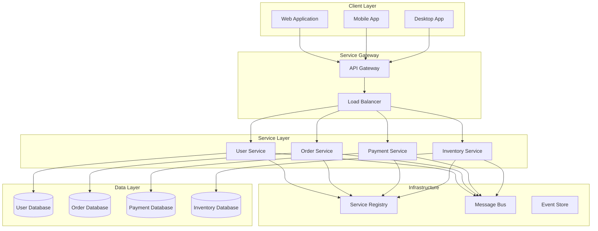
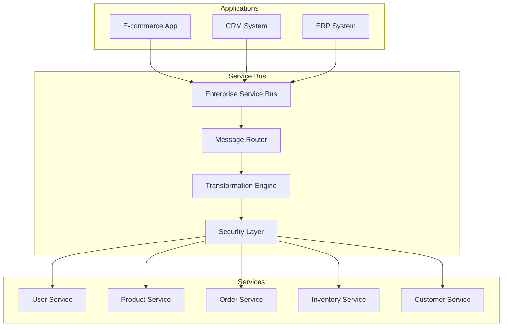

# SOA Patterns and Practical Examples

## SOA Architecture Diagrams

### 1. Basic SOA Architecture


### 2. SOA with Service Bus


## Advanced SOA Patterns

### 1. Service Mesh Pattern
```python
# Service Mesh Implementation
class ServiceMesh:
    def __init__(self):
        self.sidecars = {}
        self.control_plane = ControlPlane()
    
    def register_service(self, service_name: str, service_instance: object):
        sidecar = Sidecar(service_name, service_instance)
        self.sidecars[service_name] = sidecar
        self.control_plane.register_sidecar(sidecar)
    
    def route_traffic(self, from_service: str, to_service: str, 
                     request: dict) -> dict:
        sidecar = self.sidecars.get(from_service)
        if sidecar:
            return sidecar.forward_request(to_service, request)
        return None

class Sidecar:
    def __init__(self, service_name: str, service_instance: object):
        self.service_name = service_name
        self.service_instance = service_instance
        self.circuit_breaker = CircuitBreaker()
        self.retry_policy = RetryPolicy()
        self.metrics_collector = MetricsCollector()
    
    def forward_request(self, target_service: str, request: dict) -> dict:
        # Apply circuit breaker
        return self.circuit_breaker.call_service(
            self._make_request, target_service, request
        )
    
    def _make_request(self, target_service: str, request: dict) -> dict:
        # Collect metrics
        start_time = time.time()
        
        try:
            # Make request with retry policy
            result = self.retry_policy.execute(
                self._send_request, target_service, request
            )
            
            # Record success metrics
            self.metrics_collector.record_success(
                self.service_name, target_service, time.time() - start_time
            )
            
            return result
            
        except Exception as e:
            # Record failure metrics
            self.metrics_collector.record_failure(
                self.service_name, target_service, str(e)
            )
            raise e
    
    def _send_request(self, target_service: str, request: dict) -> dict:
        # Actual request implementation
        pass

class ControlPlane:
    def __init__(self):
        self.sidecars = {}
        self.routing_rules = {}
        self.policies = {}
    
    def register_sidecar(self, sidecar: Sidecar):
        self.sidecars[sidecar.service_name] = sidecar
    
    def configure_routing(self, service_name: str, rules: dict):
        self.routing_rules[service_name] = rules
    
    def apply_policy(self, service_name: str, policy: dict):
        self.policies[service_name] = policy
```

### 2. Event-Driven SOA
```python
# Event-Driven SOA Implementation
class EventDrivenSOA:
    def __init__(self):
        self.event_bus = EventBus()
        self.event_store = EventStore()
        self.saga_manager = SagaManager()
    
    def publish_event(self, event: dict):
        self.event_store.store_event(event)
        self.event_bus.publish(event)
    
    def subscribe_to_event(self, service_name: str, event_type: str, 
                          handler: callable):
        self.event_bus.subscribe(service_name, event_type, handler)

class EventBus:
    def __init__(self):
        self.subscribers = {}
        self.message_queue = []
    
    def publish(self, event: dict):
        event_type = event['type']
        if event_type in self.subscribers:
            for subscriber in self.subscribers[event_type]:
                self.message_queue.append({
                    'subscriber': subscriber,
                    'event': event,
                    'timestamp': datetime.now()
                })
    
    def subscribe(self, service_name: str, event_type: str, handler: callable):
        if event_type not in self.subscribers:
            self.subscribers[event_type] = []
        
        self.subscribers[event_type].append({
            'service': service_name,
            'handler': handler
        })
    
    def process_events(self):
        while self.message_queue:
            message = self.message_queue.pop(0)
            try:
                message['subscriber']['handler'](message['event'])
            except Exception as e:
                print(f"Error processing event: {e}")

class SagaManager:
    def __init__(self):
        self.active_sagas = {}
        self.saga_definitions = {}
    
    def start_saga(self, saga_type: str, saga_id: str, initial_data: dict):
        saga_definition = self.saga_definitions[saga_type]
        saga = Saga(saga_id, saga_definition, initial_data)
        self.active_sagas[saga_id] = saga
        saga.start()
    
    def handle_event(self, event: dict):
        saga_id = event.get('saga_id')
        if saga_id and saga_id in self.active_sagas:
            saga = self.active_sagas[saga_id]
            saga.handle_event(event)

class Saga:
    def __init__(self, saga_id: str, definition: dict, initial_data: dict):
        self.saga_id = saga_id
        self.definition = definition
        self.data = initial_data
        self.current_step = 0
        self.compensation_actions = []
    
    def start(self):
        self._execute_next_step()
    
    def handle_event(self, event: dict):
        if event['type'] == 'step_completed':
            self._execute_next_step()
        elif event['type'] == 'step_failed':
            self._compensate()
    
    def _execute_next_step(self):
        if self.current_step < len(self.definition['steps']):
            step = self.definition['steps'][self.current_step]
            # Execute step
            self._execute_step(step)
            self.current_step += 1
    
    def _execute_step(self, step: dict):
        # Execute step logic
        pass
    
    def _compensate(self):
        # Execute compensation actions in reverse order
        for action in reversed(self.compensation_actions):
            action.execute()
```

### 3. Microservices vs SOA
```python
# Microservices Implementation (SOA Evolution)
class MicroserviceSOA:
    def __init__(self):
        self.services = {}
        self.api_gateway = APIGateway()
        self.service_discovery = ServiceDiscovery()
        self.config_server = ConfigServer()
    
    def deploy_service(self, service_name: str, service_instance: object):
        # Deploy as independent microservice
        service_info = {
            'name': service_name,
            'instance': service_instance,
            'endpoint': f'http://{service_name}:8080',
            'health_check': f'http://{service_name}:8080/health',
            'metrics': f'http://{service_name}:8080/metrics'
        }
        
        self.services[service_name] = service_info
        self.service_discovery.register(service_info)
        self.api_gateway.add_route(service_name, service_info['endpoint'])

class APIGateway:
    def __init__(self):
        self.routes = {}
        self.middleware = []
    
    def add_route(self, service_name: str, endpoint: str):
        self.routes[service_name] = endpoint
    
    def route_request(self, service_name: str, path: str, 
                     request: dict) -> dict:
        endpoint = self.routes.get(service_name)
        if not endpoint:
            raise ServiceNotFoundError(f"Service {service_name} not found")
        
        # Apply middleware
        for middleware in self.middleware:
            request = middleware.process_request(request)
        
        # Forward request
        response = self._forward_request(endpoint, path, request)
        
        # Apply response middleware
        for middleware in reversed(self.middleware):
            response = middleware.process_response(response)
        
        return response
    
    def _forward_request(self, endpoint: str, path: str, request: dict) -> dict:
        # HTTP request implementation
        pass

class ServiceDiscovery:
    def __init__(self):
        self.services = {}
        self.health_checker = HealthChecker()
    
    def register(self, service_info: dict):
        service_info['status'] = 'healthy'
        service_info['last_heartbeat'] = datetime.now()
        self.services[service_info['name']] = service_info
    
    def discover(self, service_name: str) -> dict:
        service = self.services.get(service_name)
        if service and self.health_checker.is_healthy(service):
            return service
        return None
    
    def get_healthy_instances(self, service_name: str) -> list:
        service = self.services.get(service_name)
        if service and service['status'] == 'healthy':
            return [service]
        return []
```

## Real-World SOA Examples

### 1. E-commerce Platform
```python
# E-commerce SOA Implementation
class EcommerceSOA:
    def __init__(self):
        self.services = {
            'user': UserService(),
            'product': ProductService(),
            'cart': CartService(),
            'order': OrderService(),
            'payment': PaymentService(),
            'inventory': InventoryService(),
            'shipping': ShippingService(),
            'notification': NotificationService()
        }
        self.orchestrator = OrderOrchestrator(self.services)
    
    def process_order(self, order_data: dict) -> dict:
        return self.orchestrator.process_order(order_data)

class OrderOrchestrator:
    def __init__(self, services: dict):
        self.services = services
        self.saga = OrderSaga(services)
    
    def process_order(self, order_data: dict) -> dict:
        try:
            # Step 1: Validate customer
            customer = self.services['user'].get_customer(order_data['customer_id'])
            if not customer:
                return {'success': False, 'error': 'Customer not found'}
            
            # Step 2: Check inventory
            inventory_result = self.services['inventory'].check_availability(
                order_data['items']
            )
            if not inventory_result['available']:
                return {'success': False, 'error': 'Items not available'}
            
            # Step 3: Reserve inventory
            reservation = self.services['inventory'].reserve_items(
                order_data['items']
            )
            
            # Step 4: Process payment
            payment_result = self.services['payment'].process_payment(
                order_data['payment']
            )
            if not payment_result['success']:
                # Release reserved inventory
                self.services['inventory'].release_items(reservation['id'])
                return {'success': False, 'error': 'Payment failed'}
            
            # Step 5: Create order
            order = self.services['order'].create_order({
                'customer_id': order_data['customer_id'],
                'items': order_data['items'],
                'payment_id': payment_result['payment_id'],
                'reservation_id': reservation['id']
            })
            
            # Step 6: Send confirmation
            self.services['notification'].send_order_confirmation(
                customer['email'], order
            )
            
            return {'success': True, 'order': order}
            
        except Exception as e:
            return {'success': False, 'error': str(e)}

class OrderSaga:
    def __init__(self, services: dict):
        self.services = services
        self.compensation_actions = []
    
    def execute_order_creation(self, order_data: dict):
        # Implementation with compensation logic
        pass
```

### 2. Banking System
```python
# Banking SOA Implementation
class BankingSOA:
    def __init__(self):
        self.services = {
            'account': AccountService(),
            'transaction': TransactionService(),
            'loan': LoanService(),
            'credit': CreditService(),
            'risk': RiskAssessmentService(),
            'compliance': ComplianceService(),
            'audit': AuditService()
        }
    
    def process_transfer(self, transfer_data: dict) -> dict:
        # Multi-step transaction with compliance checks
        try:
            # Step 1: Validate accounts
            from_account = self.services['account'].get_account(
                transfer_data['from_account']
            )
            to_account = self.services['account'].get_account(
                transfer_data['to_account']
            )
            
            # Step 2: Risk assessment
            risk_result = self.services['risk'].assess_transfer_risk(
                transfer_data
            )
            if risk_result['risk_level'] == 'HIGH':
                return {'success': False, 'error': 'High risk transaction'}
            
            # Step 3: Compliance check
            compliance_result = self.services['compliance'].check_transfer(
                transfer_data
            )
            if not compliance_result['approved']:
                return {'success': False, 'error': 'Compliance check failed'}
            
            # Step 4: Process transaction
            transaction = self.services['transaction'].create_transfer(
                transfer_data
            )
            
            # Step 5: Update account balances
            self.services['account'].debit_account(
                transfer_data['from_account'], transfer_data['amount']
            )
            self.services['account'].credit_account(
                transfer_data['to_account'], transfer_data['amount']
            )
            
            # Step 6: Audit trail
            self.services['audit'].log_transaction(transaction)
            
            return {'success': True, 'transaction': transaction}
            
        except Exception as e:
            return {'success': False, 'error': str(e)}
```

### 3. Healthcare System
```python
# Healthcare SOA Implementation
class HealthcareSOA:
    def __init__(self):
        self.services = {
            'patient': PatientService(),
            'appointment': AppointmentService(),
            'medical_record': MedicalRecordService(),
            'billing': BillingService(),
            'insurance': InsuranceService(),
            'pharmacy': PharmacyService(),
            'lab': LabService(),
            'notification': NotificationService()
        }
    
    def process_appointment(self, appointment_data: dict) -> dict:
        try:
            # Step 1: Validate patient
            patient = self.services['patient'].get_patient(
                appointment_data['patient_id']
            )
            if not patient:
                return {'success': False, 'error': 'Patient not found'}
            
            # Step 2: Check doctor availability
            availability = self.services['appointment'].check_availability(
                appointment_data['doctor_id'], appointment_data['datetime']
            )
            if not availability['available']:
                return {'success': False, 'error': 'Doctor not available'}
            
            # Step 3: Create appointment
            appointment = self.services['appointment'].create_appointment(
                appointment_data
            )
            
            # Step 4: Check insurance coverage
            insurance_result = self.services['insurance'].check_coverage(
                patient['insurance_id'], appointment_data['service_type']
            )
            
            # Step 5: Create billing record
            billing_record = self.services['billing'].create_billing_record({
                'appointment_id': appointment['id'],
                'patient_id': appointment_data['patient_id'],
                'service_type': appointment_data['service_type'],
                'amount': appointment_data['amount'],
                'insurance_coverage': insurance_result['coverage']
            })
            
            # Step 6: Send appointment confirmation
            self.services['notification'].send_appointment_confirmation(
                patient['email'], appointment
            )
            
            return {
                'success': True, 
                'appointment': appointment,
                'billing': billing_record
            }
            
        except Exception as e:
            return {'success': False, 'error': str(e)}
```

## SOA Testing Strategies

### 1. Service Testing
```python
# Service Testing Framework
class ServiceTestFramework:
    def __init__(self):
        self.test_services = {}
        self.mock_services = {}
    
    def register_test_service(self, service_name: str, service_instance: object):
        self.test_services[service_name] = service_instance
    
    def create_mock_service(self, service_name: str, responses: dict):
        mock_service = MockService(responses)
        self.mock_services[service_name] = mock_service
        return mock_service
    
    def run_integration_test(self, test_scenario: dict) -> dict:
        # Set up test environment
        self._setup_test_environment()
        
        # Execute test scenario
        result = self._execute_scenario(test_scenario)
        
        # Verify results
        verification_result = self._verify_results(result, test_scenario)
        
        # Clean up
        self._cleanup_test_environment()
        
        return {
            'success': verification_result['passed'],
            'results': result,
            'verification': verification_result
        }

class MockService:
    def __init__(self, responses: dict):
        self.responses = responses
        self.call_history = []
    
    def call_method(self, method_name: str, *args, **kwargs):
        self.call_history.append({
            'method': method_name,
            'args': args,
            'kwargs': kwargs,
            'timestamp': datetime.now()
        })
        
        if method_name in self.responses:
            return self.responses[method_name]
        else:
            raise MethodNotImplementedError(f"Method {method_name} not mocked")

# Example test
def test_order_processing():
    framework = ServiceTestFramework()
    
    # Create mock services
    framework.create_mock_service('inventory', {
        'check_availability': {'available': True},
        'reserve_items': {'reservation_id': 'res_123'}
    })
    
    framework.create_mock_service('payment', {
        'process_payment': {'success': True, 'payment_id': 'pay_123'}
    })
    
    # Register real service under test
    framework.register_test_service('order', OrderService())
    
    # Run test scenario
    test_scenario = {
        'name': 'Order Processing Test',
        'steps': [
            {
                'service': 'order',
                'method': 'process_order',
                'input': {
                    'customer_id': '123',
                    'items': [{'product_id': '456', 'quantity': 2}],
                    'payment': {'card_token': 'tok_123'}
                },
                'expected_output': {'success': True}
            }
        ]
    }
    
    result = framework.run_integration_test(test_scenario)
    assert result['success'] == True
```

### 2. Performance Testing
```python
# SOA Performance Testing
class SOAPerformanceTest:
    def __init__(self, soa_system: SOASystem):
        self.soa_system = soa_system
        self.metrics_collector = MetricsCollector()
    
    def load_test(self, service_name: str, requests_per_second: int, 
                  duration_seconds: int):
        """Run load test on a specific service"""
        start_time = time.time()
        end_time = start_time + duration_seconds
        
        request_interval = 1.0 / requests_per_second
        
        while time.time() < end_time:
            request_start = time.time()
            
            try:
                # Make service request
                result = self._make_service_request(service_name)
                
                # Record success metrics
                response_time = time.time() - request_start
                self.metrics_collector.record_success(
                    service_name, response_time
                )
                
            except Exception as e:
                # Record failure metrics
                self.metrics_collector.record_failure(
                    service_name, str(e)
                )
            
            # Wait for next request
            elapsed = time.time() - request_start
            if elapsed < request_interval:
                time.sleep(request_interval - elapsed)
        
        return self.metrics_collector.get_summary()
    
    def stress_test(self, service_name: str, max_requests_per_second: int):
        """Run stress test to find breaking point"""
        current_rps = 1
        results = []
        
        while current_rps <= max_requests_per_second:
            result = self.load_test(service_name, current_rps, 60)
            results.append({
                'rps': current_rps,
                'avg_response_time': result['avg_response_time'],
                'error_rate': result['error_rate'],
                'throughput': result['throughput']
            })
            
            # Increase load
            current_rps *= 2
        
        return results

class MetricsCollector:
    def __init__(self):
        self.success_metrics = []
        self.failure_metrics = []
    
    def record_success(self, service_name: str, response_time: float):
        self.success_metrics.append({
            'service': service_name,
            'response_time': response_time,
            'timestamp': datetime.now()
        })
    
    def record_failure(self, service_name: str, error: str):
        self.failure_metrics.append({
            'service': service_name,
            'error': error,
            'timestamp': datetime.now()
        })
    
    def get_summary(self) -> dict:
        total_requests = len(self.success_metrics) + len(self.failure_metrics)
        success_count = len(self.success_metrics)
        
        avg_response_time = 0
        if self.success_metrics:
            avg_response_time = sum(m['response_time'] for m in self.success_metrics) / len(self.success_metrics)
        
        return {
            'total_requests': total_requests,
            'success_count': success_count,
            'failure_count': len(self.failure_metrics),
            'success_rate': success_count / total_requests if total_requests > 0 else 0,
            'error_rate': len(self.failure_metrics) / total_requests if total_requests > 0 else 0,
            'avg_response_time': avg_response_time,
            'throughput': success_count  # requests per test duration
        }
```

This comprehensive guide provides practical examples, patterns, and testing strategies for implementing SOA in real-world scenarios.
